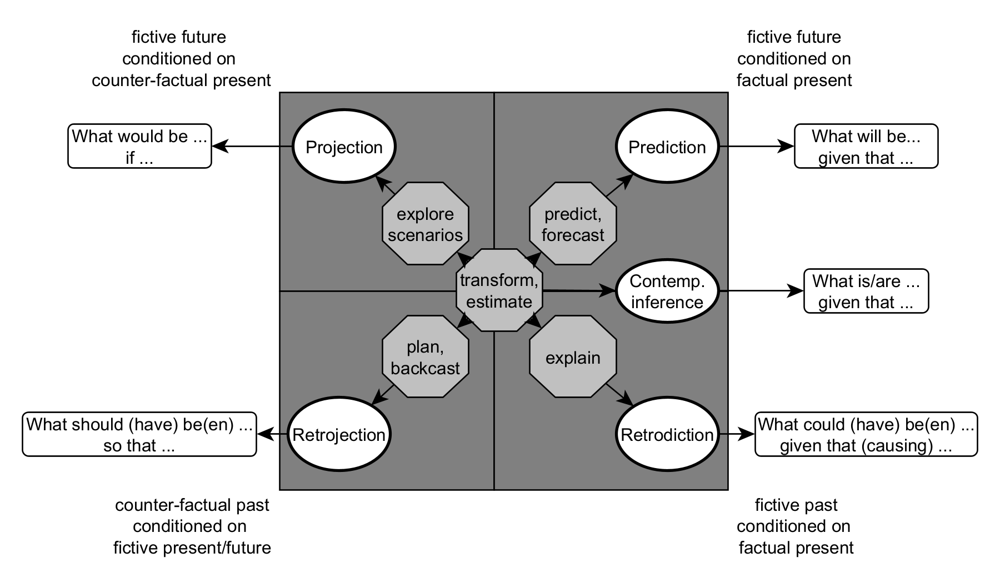

# Spatio-temporal modeling questions
 
## Description and source
This repository contains examples and Python code for a **BNF grammar** that can be used for **parsing spatio-temporal modeling questions**. The grammar is a model of the information theoretic purpose of spatio-temporal models. It is part of the publication: 
> Scheider, S., & Verstegen, J. (2024). What is a spatio-temporal model good for? Validity as a function of purpose and the questions answered by a model. Proceedings of the 16th International Conference on Spatial Information Theory 2024. Leibniz International Proceedings in Informatics, LIPIcs

The basic idea of the question grammar is illustrated with this image:


The release coresponding to the published material can be found here 


## Libraries and Python code
The grammar is implemented in [Lark](https://github.com/lark-parser/lark): 
```
from lark import Lark, tree
from rich import print
import sys
```
The example questions in the paper (and many more examples), as well as the grammar implemention, can be found in the file:
[modelQuestionGrammar.py](modelQuestionGrammar.py)

## Parse trees
The parse trees of the exampe questions can be found here:
[parseTrees](parseTrees/)
